# Procesverslag

Nb. De standaardstructuur en de spartaanse opmaak van de README.md zijn helemaal prima. Het gaat om de inhoud van je procesverslag. Besteedt de tijd voor pracht en praal aan je website.

Nb. Door *open* toe te voegen aan een *details* element kun je deze standaard open zetten. Fijn om dat steeds voor de relevante stuk(ken) te doen.

## Jij

  
uitwerken voor kick-off werkgroep

  ### Auteur:
  Diego Ramon (500921660)

  #### Je startniveau:
  Ik doe het niveau rood, en als ik tijd over heb zwart! Ik codeer zelf al een tijdje, en mijn vooropleiding was ook veel programmeren, dus ik weet zeker dat ik rood aan kan. Zwart heb ik bekeken maar is nog best moeilijk, ook voor mij. Maar als ik rood compleet heb en er is nog tijd over wil ik graag naar zwart kijken sinds dat me ook interessant lijkt! Ik ben zelf best een perfectionist, dus ik wil graag alles goed en netjes hebben, dus daarom wil ik het eerst bij rood houden in het geval dat ik alles te netjes en even wil hebben.

  #### Je focus:
  Ik zal mij voornamelijk focussen op Surface Plane. Ik vind het netjes maken van code en elementen heel leuk om te doen, ook omdat ik weet hoe grid al werkt. Maar ik ben nog niet heel goed met het vertalen van grid voor mobiel EN desktop, dus dit wil ik graag pas proberen als ik de Surface Plane opdracht helemaal af heb. Ik zal wel de website helemaal precies na proberen te maken met animaties en al.
 

## Je website

  
uitwerken voor kick-off werkgroep

  ### Je opdracht:
  https://www.koenigsegg.com/home  
  Koenigsegg home website, ik ehb deze website gekozen vanwege meerdere redenen. In het begin kon ik niet echt een goede website kiezen die mij een goed genoege challenge zou geven. Ik had eerst de Basic-Fit website, daarna nog een paar andere kleine websites. Maar na veel rond kijken en wat hulp van een mede student, genaamd Mariska Boelhouwers, ben ik op deze mooie website gekomen. Ik vond de opmaak en animaties helemaal tof dus ik wilde hier meteen aan beginnen!

  #### Screenshot(s) van de eerste pagina (small screen): 
  
  Home - Koenigsegg  
  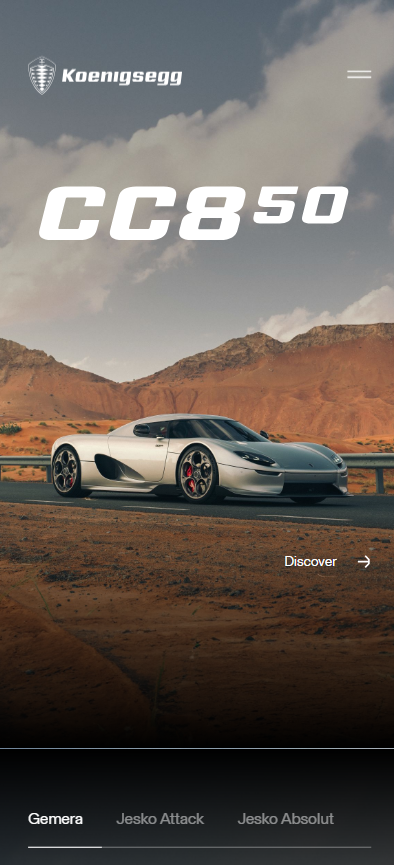

  #### Screenshot(s) van de tweede pagina (small screen):
  Jesko Absolut | Koensegg  
  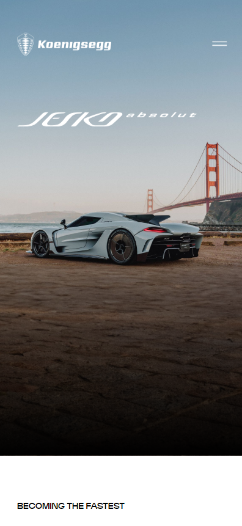
 

## Toegankelijkheidstest 1/2 (week 1)

  
uitwerken na test in 2e werkgroep

  ### Bevindingen
   

  

  

  

  

  
  
  ### Lijst met je bevindingen die in de test naar voren kwamen:
  - Website is niet heel goed blind toegankelijk
  - Veel tekst wordt overgeslagen
  - Screen reader start onderaan de website
  - Veel foto's leeg (Geen alt informatie)

  Tijdens het doen van deze test ben ik er al snel achter gekomen dat de website niet gemaakt is voor mensen met een lichamelijke aandoening. Er is bijna geen navigatie wat betreft de buttons en images; de buttons en elementen die wel tab navigatie hebben zijn vaak niet goed ingedeelt. Als je op de TAB button klikt dan begin je onderaan de website bij de footer, dan moet je eerst al die buttons af en dan ga je weer terug naar boven aan de pagina. Eenmaal terug boven aan zijn er daadwerkelijk maar iets van 4 buttons die je kan selecteren, en daarna ben je weer terug onderaan de website.
  Het hambugrer menu zelf werkt wel, maar is moeilijk om bij te komen door het vorige opgenoemde probleem.
  Ook kan je de foto's zelf niet selecteren, dus krijgen blinde mensen niet de horen wat er daadwerkelijk wordt weergegeven omdat er geen alt tekst is.

## Breakdownschets (week 1)

  
uitwerken na afloop 3e werkgroep

  ### de hele pagina: 
  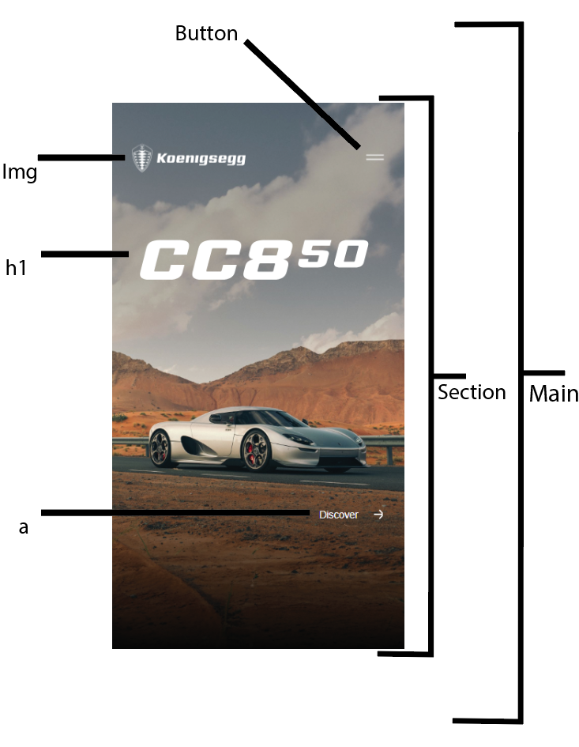
   
  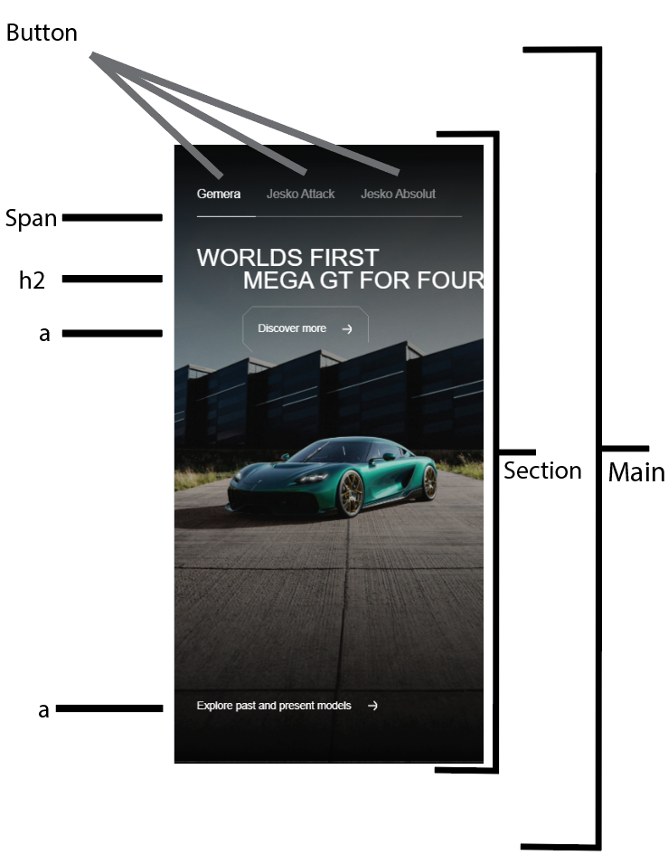
   
  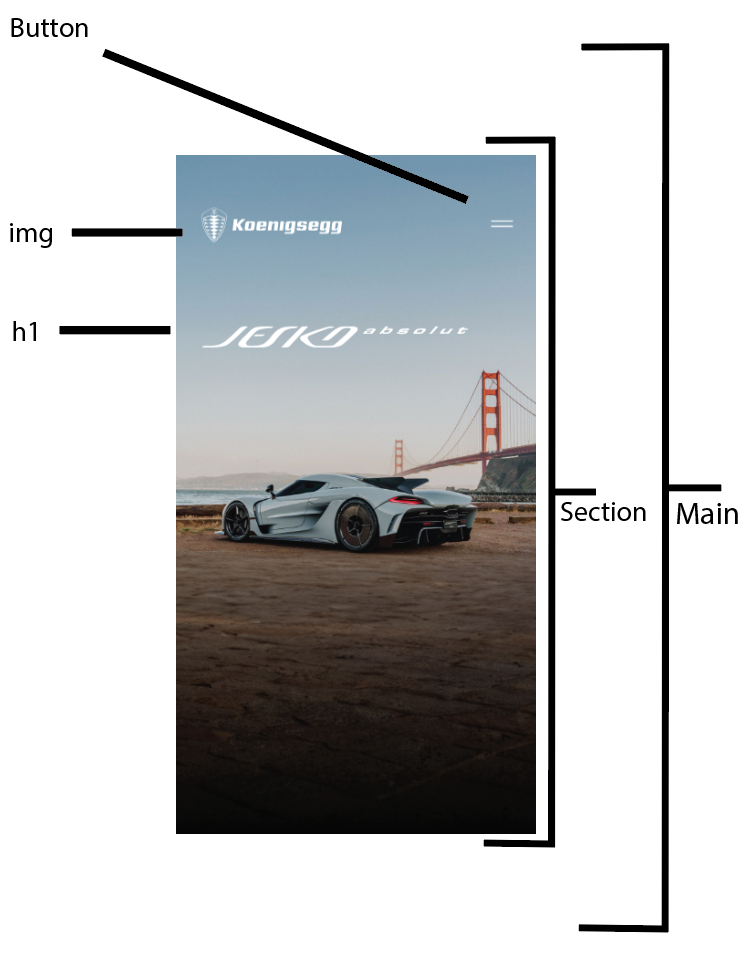
   
  
   
  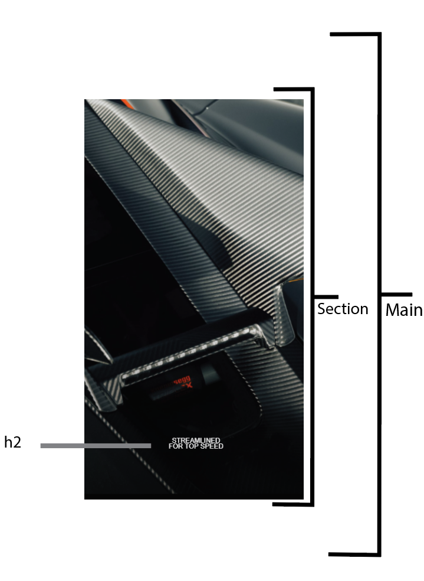
  

  ### dynamisch deel (bijv menu): 
  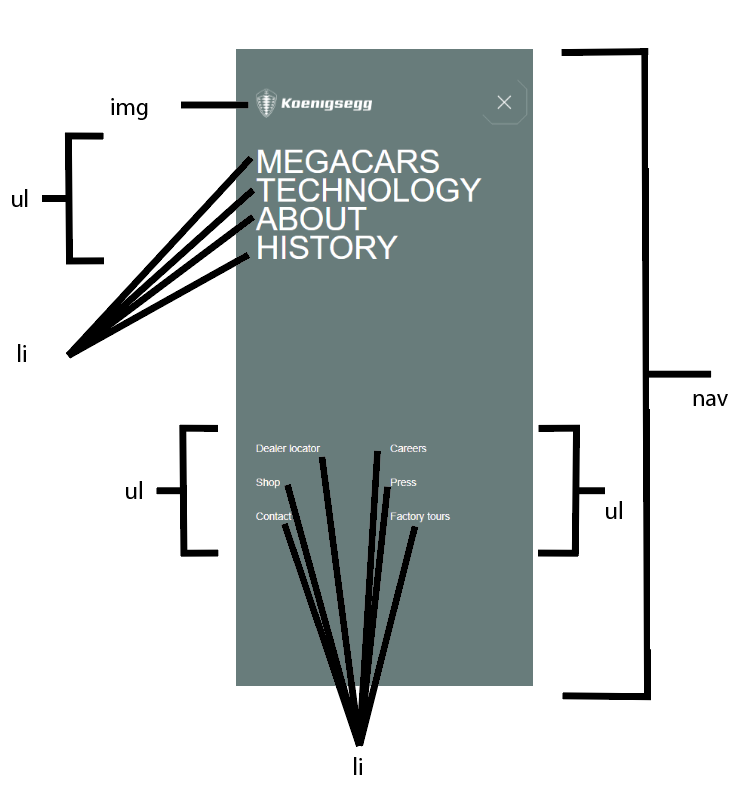

  ### wellicht nog een dynamisch deel (bijv filter): 
  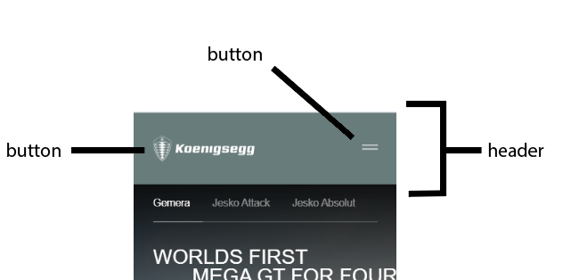
   
  Ik heb voor de eerste paar schetsen de meest belangrijke onderdelen uitgewerkt die niet vaak worden herhaalt of uniek van zichzelf zijn op de pagina's die ik heb uitgekozen. Ik heb van de eerst pagina twee screenshots uitgewerkt waar je duidelijk kan zien welke elementen waar worden gebruikt. De eerste foto is de aller erste section die je krijgt te zien als je de website net bezoekt, dit bestaat uit een logo, menu, een h1 en een button. Daarna krijg je de tweede section te zien op de tweede foto, en dit zijn showcases van autos met button die lijden naar andere fotos en buttons van auto's.
  Voor de tweede pagina heb ik drie screenshots uitgewerkt die alle drie uniek zijn. De eerste foto is van de aller eerste section van die pagina, dit is wat je als eerst krijgt te zien als je deze pagina bezoekt. Daarna de tweede section, dit is voornamelijk tekst en informatie, en de derde seciton is een foto met een h2

## Voortgang 1 (week 2)

  
uitwerken voor 1e voortgang

  ### Stand van zaken
  hier dit ging goed & dit was lastig (neem ook screenshots op van delen van je website en code)

  Ik vond dat het programmeren en bedenken van code zelf zeer goed ging, ik had weinig problemen tot nu toe en kon alles vrij makkelijk doen, mijn opbouw van de website gaat ook zeer snel en heeft op dit moment een zeer goede snelheid waar ik blij mee ben. Ook vind ik dat het programmeren met grid heel goed is gegaan. Door het grid systeem is de hele website bouwen 100x makkelijker geworden.
   
  ### Grid Sections
  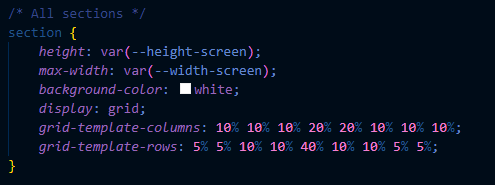

  ### Header Code
  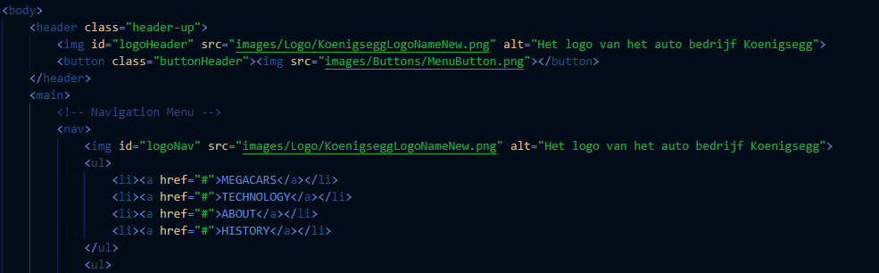

  ### Javascript for Hamburger Menu
  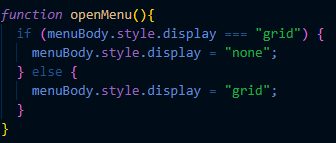

  ### Agenda voor meeting
  samen met je groepje opstellen

  | Diego          | Chanel             | Yasmine        | -                |
  | ---            | ---                | ---            | ---              |
  | Hamburger menu | Headings           | algemene check | ---              |
  | headings       | Opmaak             | ...            | ---              |
  | ...            | Algemeen check     | ...            | ...              |

  ### Verslag van meeting
  hier na afloop snel de uitkomsten van de meeting vastleggen

  - Let voornamelij op de heading types
  - Alt tekst
  - Hamburger menu maken
 
In het algemeen zag de website er al zeer goed uit en was Ivo zeer blijh met de progressie, hij vond wel dat de github read.me er best leeg uitzag en vond da tik er meer an moet zitten. Verder moet ik in het vervolg beter opletten op welke headings ik gebruik. Nu heb ik meerdere h2's of h3's op verkeerde volgorde staan terwijl er een duidelijke hierarchie is voor deze elementen. Ook kreeg ik antwoord op mijn vraag wat betreft de hamburger menu's, maar dit kan ik gewoon maken zonder problemen.
 

### Klein overzicht van de meeting
- Maak de code goed semantisch, voornamelijk de HTML
- Toegankelijkheidstest mag meer uitgebreid
- Niet alles in lijstjes doen
- Voeg maar eenmaal een H1 toe bovenaan de pagina
- In elke section H2 gebruiker
- H3 pas in of onder een H2 gebruiken
- Classes en ID's alleen waar nodig is

## Voortgang 2 (week 3)

  
uitwerken voor 2e voortgang

  ### Stand van zaken
  Tot nu toe verloopt het coderen van mijn hele websites verassend soepel, ik heb nog geen problemen gehad en alles verloopt precies zoals ik wil. Ik heb het wel druk, dus het tempo is minder hoog dan gewilt, maar de progressie gaat goed en zoals het nu verloopt hebben de student-assistenten er vol vertrouwen in dat ik het haal.

  Ik vond het persoonlijk heel leuk om weer een goed werkende hamburger menu te maken, ik had alleen zelf nog een paar vragen hoe ik een goede animatie kon toevoegen. Ik heb al basis kennis over animeren, maar deze animatie was meer advanced dan ik gewend ben, dus ik had daar zeker hulp bij nodig.

  Het opbouwern van de website zelf ging ook verassend goed, het idee van eerst de content erin zetten en dan stylen ging verassend goed. Ik had hier en daar wat elementen waar ik wat langer mee bezig was, maar tot nu toe had ik geen onderwerpen waar ik dagen lang aan vast ben blijven zitten

  Ik ben voor nu van plan om meerdere animaties te maken voor op de website, dat houd in:
  - Een open animatie voor het hamburger menu
  - Een OnScroll animatie die ervoor zorgt dat de text tevoorschijn komt
  - Een OnScroll Animatie die ervoor zorgt dat image tevoorschijn komen.
  - Kleine animaties zoals transitions of andere kleine overgangen waar keyframes voor nodig zijn

  ### Agenda voor meeting
  samen met je groepje opstellen

  | Diego          | Chanel             | Yasmine        | -                |
  | ---            | ---                | ---            | ---              |
  | Animaties      | Headings           | algemene check | ---              |
  | ...            | Opmaak             | ...            | ---              |
  | ...            | Algemeen check     | ...            | ...              |

  ### Verslag van meeting
  hier na afloop snel de uitkomsten van de meeting vastleggen

  - Tips over animaties gekregen, ik heb een goede website gekregen die ik kan gebruiken! (Staat bij de bronnenlijst)
  - Kort over de code heen gegaan
  - Meegekeken hoe je een carousel goed automatisch kon maken.

## Toegankelijkheidstest 2/2 (week 4)

  
uitwerken na test in 9e werkgroep

  

  

  

  

  
  
  ### Bevindingen
  Lijst met je bevindingen die in de test naar voren kwamen:
   
  - Ik heb mijn website goed verwerkt wat betreft toegankelijkheid.
  - Er missen hier en daar nog een paar elementen maar alles loopt goed bij (Er missen een paar buttons)
  - Ik kon niet de hele checklist afvinken omdat de pagina's die ik heb gekozen niet alle elementen bevatten die ik moet uittesten (Videos, gifs, etc.)
  - Alt teksten zijn wel aanwezig.
  - Ik heb een logische volgorde toegevoegd aan mijn buttons, op de originele pagina begint de screenreader onderaan.
 

Omdat ik vorige keer de originele website heb getest wist ik wel waar ik naar toe moest werken. Er moesten veel verbeteringen worden gemaakt wat betreft de toegankelijkheid. Buttons hadden een verkeerde volgorde en startte onderaan, en sommige buttons werden helemaal niet geselecteerd. Dit is allemaal gefixed op mijn website. Ook heeft elke foto nu een alt tekst; dit was ook iets dat de originele pagina niet had.
Het hamburger menu kan je nu ook openen door midden van de TAB button, en in de hamburger menu kan je nu ook weer weg navigeren.
De tweede pagina had eigenlijk de zelfde problemen en deze zijn ook opgelost.

## Voortgang 3 (week 4)

  
uitwerken voor 3e voortgang

  ### Stand van zaken
  Toen ik bij dit gesprek aankwam had ik eigenlijk bijna geen probleme om te melden of vragen aan de docent, ik was best goed op gang en had ook al helemaal een plan hoe is alles uit moest shcrijven. Dus ik kwam eigenlijk de les in zonder super veel vragen te hebben voorbereid. Ik had maar 1 goede vraag om te stellen; dit was dan ook meteen de enige vraag die ik had.
  1. Ik heb dus een klein probleempje wanneer ik mijn hamburger menu open. Ik ben dus ook gaan testen om mijn website goed toegankelijk te krijgen, maar wanneer ik op TAB klik om de buttons af te gaan selecteert hij ook de buttons achter het hamburger menu. Dit is natuurlijk niet handig als je niet ziet wat er gebeurt. Ik weet wel waar het probleem ligt, maar heb hier geen fix op.

  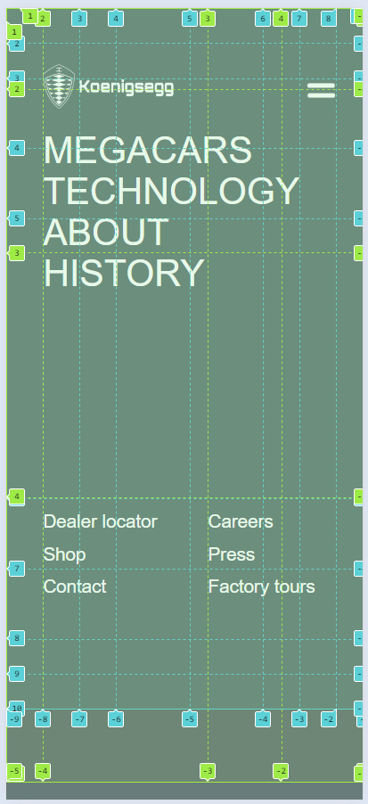

  ### Agenda voor meeting
  samen met je groepje opstellen

  | Diego          | Chanel             | Yasmine          | student 4        |
  | ---            | ---                | ---              | ---              |
  | Hamburger Menu | Footer             | Responsive maken | en dan ik dat    |
  | ...            | Carousel           | ...              | dit wil ik zeker |
  | ...            | Inschrijf formulier| ...              | ...              |
  | ...            | Light/Dark mode    | ...              | ...              |
  | ...            | Videos             | ...              | ...              |
  | ...            | Reduced motion     | ...              | ...              |

  ### Verslag van meeting
  hier na afloop snel de uitkomsten van de meeting vastleggen

  - Ik heb dus een paar tips gekregen van de docent om mijn hamburger menu te fixen op een manier dat ik TAB in kan klikken en niet op de pagina erachter kom. Deze fixen zijn ook nog niet comfirmed dus ik moet ze zelfs uittesten.
  - Ik heb ook nog een paar details gehoord van andere studenten, waaronder het feit dat we eerst moeten focussen op de eerste pagina en daarna pas de tweede. Quantity >>> Quality

## Eindgesprek (week 5)

  
uitwerken voor eindgesprek

  ### Je uitkomst - karakteristiek screenshots:
  

  ### Dit ging goed/Heb ik geleerd: 
  Korte omschrijving met plaatjes

  

  ### Dit was lastig/Is niet gelukt:
  Korte omschrijving met plaatjes

  

## Bronnenlijst

  
continu bijhouden terwijl je werkt

  Nb. Wees specifiek ('css-tricks' als bron is bijv. niet specifiek genoeg). 
  Nb. ChatGpT en andere AI horen er ook bij.
  Nb. Vermeld de bronnen ook in je code.

  1. https://www.koenigsegg.com
  2. https://www.koenigsegg.com/model/jesko-absolut
  3. [Koenigsegg search Link](https://www.google.com/search?q=koenigsegg&client=opera-gx&hs=0F3&sca_esv=24731a508b288d28&sca_upv=1&sxsrf=ADLYWIKtnU6MareJp1gvp1XBgV5XtMP8JA%3A1725648579442&ei=w07bZtDJGoCJ9u8Pz9zVuAE&oq=koe&gs_lp=Egxnd3Mtd2l6LXNlcnAiA2tvZSoCCAEyChAjGIAEGCcYigUyChAjGIAEGCcYigUyChAAGIAEGEMYigUyChAAGIAEGEMYigUyEBAAGIAEGLEDGEMYgwEYigUyEBAAGIAEGLEDGEMYgwEYigUyExAuGIAEGLEDGNEDGEMYxwEYigUyChAAGIAEGEMYigUyCxAAGIAEGLEDGIMBMgsQABiABBixAxiDAUjmClAAWI4CcAB4AJABAJgBQqABtgGqAQEzuAEDyAEA-AEBmAIDoALAAcICBBAjGCfCAhEQLhiABBixAxjRAxiDARjHAcICCBAAGIAEGLEDwgIFEAAYgATCAg4QABiABBixAxiDARiKBZgDAJIHATOgB_si&sclient=gws-wiz-serp)
  4. https://codepen.io/Mikystone/pen/poyZoYa
  5. https://codepen.io/webmarcello8080/pen/KKbzMQQ
  6. https://bennettfeely.com/clippy/
  7. https://stackoverflow.com/questions/68441473/how-can-i-trigger-this-animation-to-start-once-in-viewport
  8. https://stackoverflow.com/questions/16751345/automatically-close-all-the-other-details-tags-after-opening-a-specific-detail
  9. https://stackoverflow.com/questions/21319503/select-and-add-class-in-javascript

